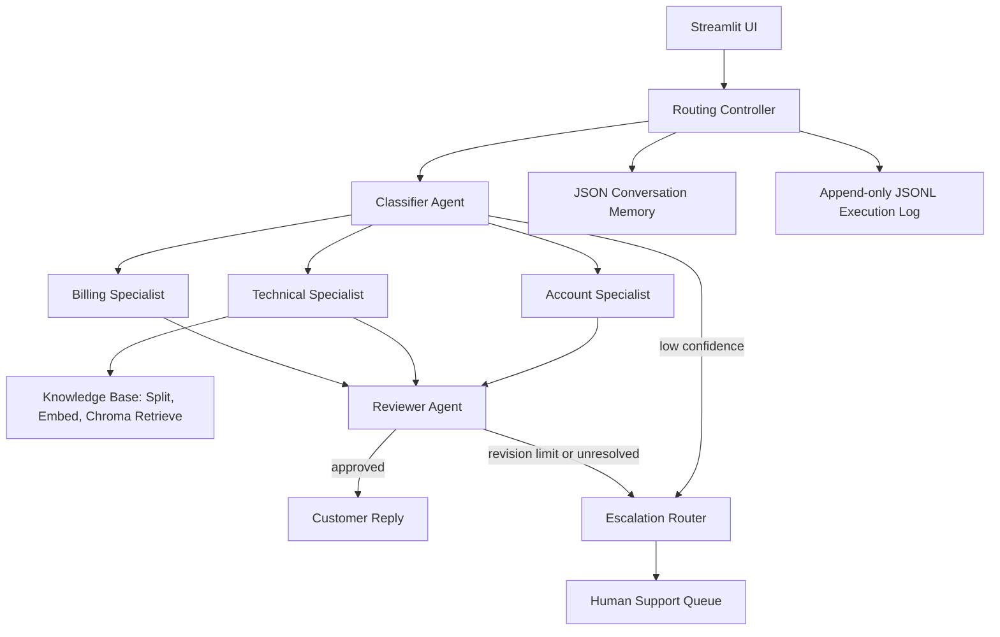

# SupportX Architecture

```mermaid
flowchart TD
    UI[Streamlit UI] --> Controller[Routing Controller]
    Controller --> Classifier[Classifier Agent]
    Classifier --> Billing[Billing Specialist]
    Classifier --> Technical[Technical Specialist]
    Classifier --> Account[Account Specialist]
    Technical --> RAG[Knowledge Base: Split, Embed, Chroma Retrieve]
    Billing --> Reviewer[Reviewer Agent]
    Technical --> Reviewer
    Account --> Reviewer
    Reviewer -->|approved| Reply[Customer Reply]
    Reviewer -->|revision limit or unresolved| Escalation[Escalation Router]
    Classifier -->|low confidence| Escalation
    Escalation --> Human[Human Support Queue]
    Controller --> Memory[JSON Conversation Memory]
    Controller --> Logs[Append-only JSONL Execution Log]
```